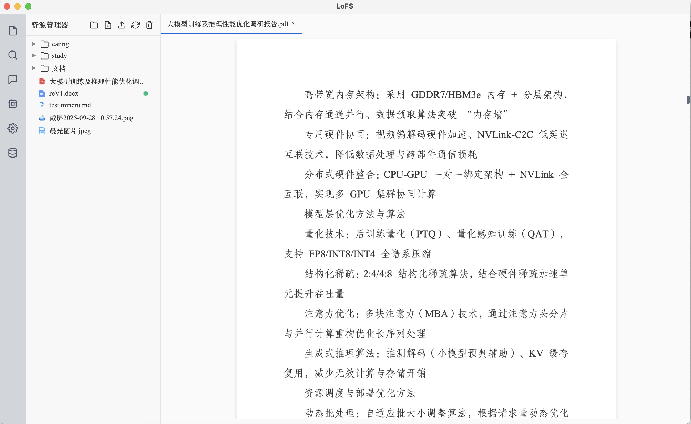

<div style="display:flex; align-items:center; gap:18px; padding:18px 24px; background:#ffffff; border-radius:18px; box-shadow:0 18px 46px rgba(15,23,42,0.08);">
  <div style="flex:0 0 120px;">
    
  </div>
  <div style="flex:1;">
    <h1 style="margin:0 0 12px 0;">🗂️ LoFS · Load once Fast Search</h1>
    <div style="font-size:14px; line-height:1.6; color:#475467;">
      <p style="margin:0 0 6px 0; color:#1f2933;">
        <a href="README_EN.md">English</a> ｜ <strong>中文</strong>
      </p>
      <p style="margin:0; color:#1f2933;">
        LoFS（Load once Fast Search）是一款面向本地知识库的桌面级文件管理与信息检索应用，只需挂载一次，后续即可获得毫秒级的全文与语义检索体验。
      </p>
    </div>
  </div>
</div>

## 1. 项目简介
LoFS 聚焦“本地优先”的知识管理场景，将文件管理与语义检索合二为一：
- 🔍 **多模态处理**：自动解析 `.md`、`.txt`、`.docx`、`.pdf`、`.pptx`、`.json` 等文本与图像内容。
- 📁 **文件树交互**：支持一键挂载/卸载、PDF 专属解析、进度实时可视化。
- 🧠 **主题驱动检索**：在传统 Faiss/BM25s/reranker 之上引入“文档主题摘要 + 语义/词法加权”的两阶段检索，问题可先与摘要匹配再回退全文。
- 🤖 **多平台模型接入**：内置 SiliconFlow，并新增对 ModelScope、通义千问（DashScope）的兼容，支持在线连通性检测、流式问答与 `<think>` 思考返回。
- 💬 **智能聊天体验**：聊天页记住上次选用的模型，重启后即刻恢复；模型输出的思考内容会以灰色卡片独立展示，方便分析与引用。
- 🔒 **本地优先**：所有文件、向量与索引均保存在本地 SQLite 与 Faiss 中，核心数据不出域。
- 🛠️ **开箱即用**：Electron 桌面端 + FastAPI 后端，兼容多系统打包。

| PDF深度解析&Markdown在线查看 | 📑 PDF 文件查看 | 🔎 PPTX文件查看 |
|:--:|:--:|:--:|
|  |  |  |

## 2. 技术架构
- **桌面端（Electron）**：负责文件树、解析状态、检索结果的交互体验。
- **后端（FastAPI）**：承载挂载、解析、索引构建等核心任务，提供 REST API。
- **检索引擎**：通过 Faiss、BM25s 与 FlagEmbedding（BGE 系列）构成的混合检索流水线，支持文本与图像向量，并内置主题摘要检索通路。
- **模型管理**：前端提供模型库视图，可添加自定义模型并测试连通性；支持 SiliconFlow、ModelScope 与通义千问（DashScope）三大平台。
- **数据存储**：SQLite 保存结构化元数据，Faiss 保存向量索引，本地文件系统管理模型与缓存。

```text
┌─────────────┐      IPC/HTTP      ┌───────────────┐
│ Electron UI │ ─────────────────▶ │ FastAPI Server│
└─────────────┘                   └──────┬────────┘
          │                               │
          ▼                               ▼
   文件系统监听                    任务调度 / 模型管理
                                        │
                                        ▼
                              SQLite · Faiss · Meta 模型目录
```

## 3. 核心流程
1. 🗂️ **挂载目录**：选择本地文件夹后，系统记录路径并触发首次解析。
2. 📄 **多模态解析**：抽取文本、切分段落，提取图片并生成 CLIP 向量，解析进度实时反馈。
3. 🧮 **索引构建**：将文本向量写入 Faiss，将关键词倒排写入 BM25s，元数据落盘至 SQLite。
4. 🧾 **生成主题摘要**（可选）：启用“文档总结”后，调用指定模型为整篇文档生成主题概述，并写入独立向量与 SQLite。
5. 🔎 **分层检索**：输入查询后先与主题摘要做语义/词法混合匹配（分数 ≥ 0.7 即入选），命中文档的完整内容 + 摘要会一并注入提示词；若无命中则自动回退至传统混合检索。
6. 💬 **LLM 问答**：选择任一已配置的模型即可发起流式对话；若模型支持思考输出（ModelScope、DashScope），LoFS 会将 `<think>` 内的内容转成灰色卡片单独展示。

模型目录按需懒加载，首次使用对应能力时自动下载；也可以提前拉取以免首轮等待：

### 3.1 主题检索亮点
- 🎯 **摘要优先召回**：针对每篇文档生成主题概述并向量化，问题先与摘要对齐，优先命中文档级语义，而非被动依赖局部段落。
- ⚖️ **语义 × 词法加权**：摘要向量得分与 BM25 摘要评分按固定权重融合（默认 0.6/0.4），兼顾泛化与精确匹配，避免单纯向量检索的偏差。
- 🔁 **稳健回退**：摘要得分不足时自动降级到混合检索，保持稳定的检索体验；命中文档会附带“参考文档主题”卡片，解释命中原因。
- 🧩 **上下文注入优化**：被选中文档的主题摘要 + 全部 chunk 一并注入 LLM 提示词，提示模型围绕主题回答，同时提高引用准确率。

```bash
python -c "from service.model_manager import get_model_manager; manager = get_model_manager(); [manager.get_model_path(key) for key in ('bge_m3', 'bge_reranker_v2_m3', 'clip_vit_b_32', 'clip_vit_b_32_multilingual', 'pdf_extract_kit')]"
```

### 3.2 多平台模型接入
- 在 **设置 → API Key** 中填写对应凭证：
  - SiliconFlow：`siliconflwApiKey`
  - ModelScope：`modelscopeApiKey`
  - 通义千问（DashScope）：`qwenApiKey`
- 进入 **模型库 → 添加模型**，选择平台即可测试连通性；失败时会返回接口错误信息辅助排查。
- 聊天页面的模型下拉会记住上次选择，重启后自动恢复；支持流式输出，若模型返回 `<think>` 思考段落会以灰色卡片单独展示（默认适用于 ModelScope、DashScope）。

## 4. 部署使用
### 4.1 环境要求
| 组件 | 最低版本 | 推荐 |
| --- | --- | --- |
| Python | 3.8 | 3.10+ |
| Node.js | 16 | 18+ |
| npm | 8 | 最新 LTS |
| 操作系统 | Windows / macOS / Linux | — |

### 4.2 安装步骤
```bash
# 克隆仓库
git@github.com:Oli51467/local_fs.git
cd LocalFS

# 后端依赖
python -m venv .venv
source venv/bin/activate        # Windows: venv\Scripts\activate

cd server
pip install -r server/requirements.txt

# 前端依赖
cd electron
npm install
```

### 4.3 启动项目
```bash
cd electron
npm run dev
```

### 4.4 打包与模型资源管理
```bash
python package.py # 一键打包
```

- 应用启动时会在 `meta` 目录创建所需模型文件夹（`embedding/bge-m3`、`embedding/clip`、`embedding/clip-Vit-32B-multilingual`、`reranker/bge-reranker-v3-m3`、`pdf-extract-kit`）。
- 首次使用向量化、重排、主题摘要、图像检索或 PDF 解析时，会通过 `huggingface_hub` 自动下载对应模型。
- 即便清空 `meta` 目录，LoFS 也会在下次启动时自动恢复目录结构。

## 5. 聊天与图像理解实践
- **模型选择**：在模型库中添加 `qwen3-vl-plus` 或其他具备视觉理解能力的模型，并确保 DashScope API Key 已在设置页面填写；聊天页会记住上次选中的模型。
- **图片上传**：支持拖拽或文件选择将图片添加到输入框，图片会在发送后立即从输入面板清空，聊天记录中保留原始比例与缩放的缩略图，可点击放大查看。
- **上下文持久化**：每条消息的附件会写入本地 SQLite，重新打开对话即可回放历史图片；聊天中断后再次进入也会自动恢复模型、检索模式等配置。
- **多轮协作**：主题检索与普通检索的动画示例已收录于上方表格，可参考其流程在聊天中切换问题类型并结合引用卡片快速定位文档。

## 6. 常见问题与建议
| 场景 | 处理建议 |
| --- | --- |
| 图片上传后仍显示在输入框 | 发送成功后若仍存在缩略图，可点击右上角的“停止”按钮重置会话，再次发送时图片会自动清空；确认未在浏览器调试面板中屏蔽 `blob:` 资源。 |
| DashScope 连通性测试失败 | 检查 `qwenApiKey` 是否正确填写，确保本地服务的 `FS_APP_API_HOST/PORT` 与 Electron 端保持一致；若使用代理，请在终端中导出 `HTTPS_PROXY` 环境变量。 |
| 主题检索无结果 | 核对是否启用“文档总结”开关，并确认相关文档已完成摘要构建；可在后台日志中查看 `summary_search_applied` 字段了解是否触发回退。 |
| 模型返回 `<think>` 但界面无灰色面板 | 仅当模型在 SSE 流中携带 `reasoning_content` 字段时会渲染思考卡片，若是第三方兼容端点，请确认其输出符合 OpenAI Chat Completions 协议。 |
| 重新打包后模型目录过大 | 发版前执行 `rm -rf meta/*` 清理缓存模型，部署机首次启动会重新按需下载；若需要离线包，可在 `package.py` 中自定义保留模型列表。 |
