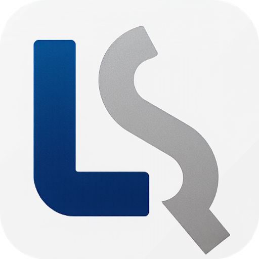
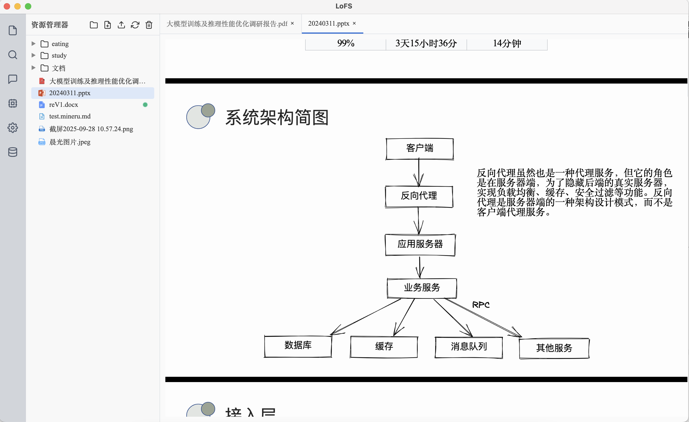

<div style="display:flex; align-items:center; gap:18px; padding:18px 24px; background:#ffffff; border-radius:18px; box-shadow:0 18px 46px rgba(15,23,42,0.08);">
  <div style="flex:0 0 120px;">
    
  </div>
  <div style="flex:1;">
    <h1 style="margin:0 0 12px 0;">🗂️ LoFS · Load once Fast Search</h1>
    <div style="font-size:14px; line-height:1.6; color:#475467;">
      <p style="margin:0 0 6px 0; color:#1f2933;">
        <a href="README_EN.md">English</a> ｜ <strong>中文</strong>
      </p>
      <p style="margin:0; color:#1f2933;">
        LoFS（Load once Fast Search）是一款面向本地知识库的桌面级文件管理与信息检索应用，只需挂载一次，后续即可获得毫秒级的全文与语义检索体验。
      </p>
    </div>
  </div>
</div>

## 1. 项目简介
LoFS 聚焦“本地优先”的知识管理场景，将文件管理与语义检索合二为一：
- 🔍 **多模态处理**：自动解析 `.md`、`.txt`、`.docx`、`.pdf`、`.pptx`、`.json` 等文本与图像内容。
- 📁 **文件树交互**：支持一键挂载/卸载、PDF 专属解析、进度实时可视化。
- 🧠 **混合检索**：融合 Faiss 向量索引、BM25s 关键词召回与 reranker 重排序模型。
- 🔒 **本地优先**：所有文件、向量与索引均保存在本地 SQLite 与 Faiss 中，核心数据不出域。
- 🛠️ **开箱即用**：Electron 桌面端 + FastAPI 后端，兼容多系统打包。

| PDF深度解析&Markdown在线查看 | 📑 PDF 文件查看 | 🔎 PPTX文件查看 |
|:--:|:--:|:--:|
|  |  |  |

## 2. 技术架构
- **桌面端（Electron）**：负责文件树、解析状态、检索结果的交互体验。
- **后端（FastAPI）**：承载挂载、解析、索引构建等核心任务，提供 REST API。
- **检索引擎**：通过 Faiss、BM25s 与 FlagEmbedding（BGE 系列）构成的混合检索流水线，支持文本与图像向量。
- **数据存储**：SQLite 保存结构化元数据，Faiss 保存向量索引，本地文件系统管理模型与缓存。

```text
┌─────────────┐      IPC/HTTP      ┌───────────────┐
│ Electron UI │ ─────────────────▶ │ FastAPI Server│
└─────────────┘                   └──────┬────────┘
          │                               │
          ▼                               ▼
   文件系统监听                    任务调度 / 模型管理
                                        │
                                        ▼
                              SQLite · Faiss · Meta 模型目录
```

## 3. 核心流程
1. 🗂️ **挂载目录**：选择本地文件夹后，系统记录路径并触发首次解析。
2. 📄 **多模态解析**：抽取文本、切分段落，提取图片并生成 CLIP 向量，解析进度实时反馈。
3. 🧮 **索引构建**：将文本向量写入 Faiss，将关键词倒排写入 BM25s，元数据落盘至 SQLite。
4. 🔎 **混合检索**：输入查询后并行执行语义检索与关键词召回，再由 reranker 综合打分返回结果。

模型目录按需懒加载，首次使用对应能力时自动下载；也可以提前拉取以免首轮等待：

```bash
python -c "from service.model_manager import get_model_manager; manager = get_model_manager(); [manager.get_model_path(key) for key in ('bge_m3', 'bge_reranker_v2_m3', 'clip_vit_b_32', 'clip_vit_b_32_multilingual', 'pdf_extract_kit')]"
```

## 4. 部署使用
### 4.1 环境要求
| 组件 | 最低版本 | 推荐 |
| --- | --- | --- |
| Python | 3.8 | 3.10+ |
| Node.js | 16 | 18+ |
| npm | 8 | 最新 LTS |
| 操作系统 | Windows / macOS / Linux | — |

### 4.2 安装步骤
```bash
# 克隆仓库
git@github.com:Oli51467/local_fs.git
cd LocalFS

# 后端依赖
python -m venv venv
source venv/bin/activate        # Windows: venv\Scripts\activate

cd server
pip install -r server/requirements.txt

# 前端依赖
cd electron
npm install
```

### 4.3 启动项目
```bash
cd electron
npm run dev
```

### 4.4 打包与模型资源管理
```bash
python package.py # 一键打包
```

- 应用启动时会在 `meta` 目录创建所需模型文件夹（`embedding/bge-m3`、`embedding/clip`、`embedding/clip-Vit-32B-multilingual`、`reranker/bge-reranker-v3-m3`、`pdf-extract-kit`）。
- 首次使用向量化、重排、图像检索或 PDF 解析时，会通过 `huggingface_hub` 自动下载对应模型。
- 即便清空 `meta` 目录，LoFS 也会在下次启动时自动恢复目录结构。
