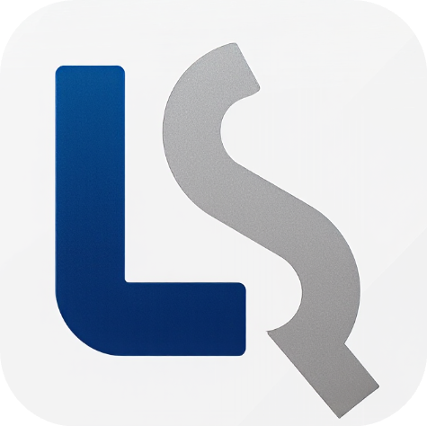
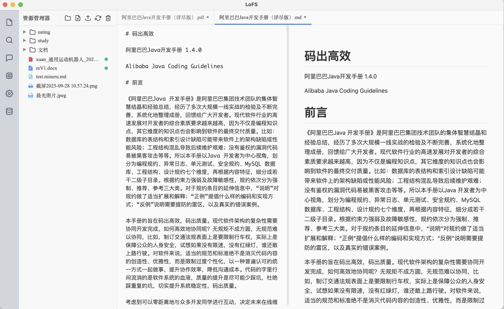
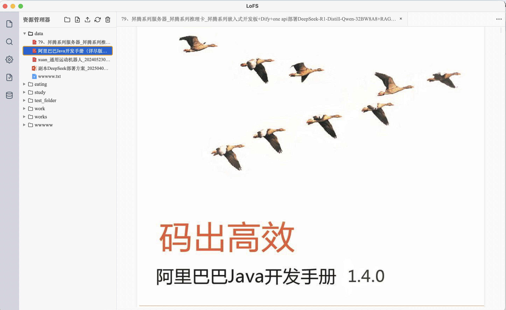
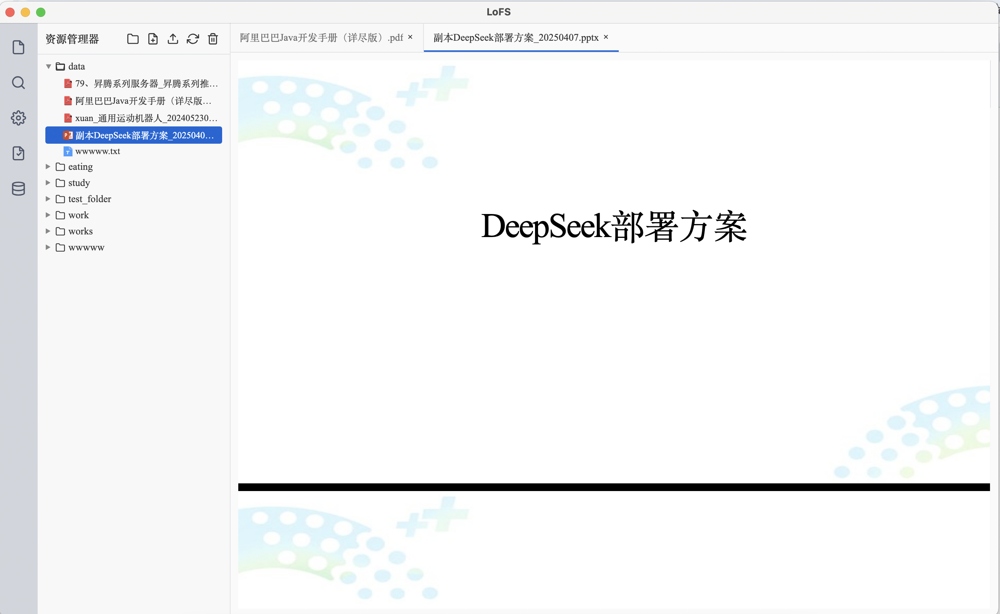

<div style="display:flex; align-items:center; gap:18px; padding:18px 24px; background:#ffffff; border-radius:18px; box-shadow:0 18px 46px rgba(15,23,42,0.08);">
  <div style="flex:0 0 120px;">
    
  </div>
  <div style="flex:1;">
    <h1 style="margin:0 0 12px 0;">🗂️ LoFS · Load once Fast Search</h1>
    <div style="font-size:14px; line-height:1.6; color:#475467;">
      <p style="margin:0 0 6px 0; color:#1f2933;">
        <strong>English</strong> ｜ <a href="README.md">中文</a>
      </p>
      <p style="margin:0; color:#1f2933;">
        LoFS (Load once Fast Search) is a desktop-first knowledge base manager for local files. Mount a directory once and enjoy millisecond hybrid search afterwards.
      </p>
    </div>
  </div>
</div>

## 1. Project Overview
LoFS fuses local file organization with semantic retrieval to deliver an “always up to date” knowledge workspace:
- 🔍 **Multimodal ingestion**: parses `.md`, `.txt`, `.docx`, `.pdf`, `.pptx`, `.json`, and extracts both text and images.
- 📁 **Explorer-style UX**: mount/remount flows, PDF-only parsing, and live progress indicators keep operations transparent.
- 🧠 **Hybrid retrieval**: combines Faiss vector search, BM25s keyword recall, and transformer-based reranking.
- 🔒 **Local-first by design**: SQLite and Faiss stay on disk, ensuring data never leaves your machine.
- 🛠️ **Shipping-ready app**: Electron desktop shell plus FastAPI backend, complete with cross-platform packaging scripts.

| PDF Deep Extraction & Markdown Preview | 📑 PDF Viewer | 🔎 PPTX Viewer |
|:--:|:--:|:--:|
|  |  |  |

## 2. Technical Architecture
- **Electron desktop**: renders the file tree, orchestration panels, and search UI.
- **FastAPI backend**: exposes REST endpoints for mounting, parsing, indexing, and retrieval orchestration.
- **Retrieval pipeline**: Faiss + BM25s + FlagEmbedding (BGE family) power fast semantic and keyword blending, including CLIP embeddings for images.
- **Storage layer**: SQLite for metadata, Faiss for vector indices, and the local filesystem for model caches.

```text
┌─────────────┐      IPC/HTTP      ┌───────────────┐
│ Electron UI │ ─────────────────▶ │ FastAPI Server│
└─────────────┘                   └──────┬────────┘
          │                               │
          ▼                               ▼
   File system watch               Task queue / Model manager
                                        │
                                        ▼
                              SQLite · Faiss · Meta models
```

## 3. Core Workflow
1. 🗂️ **Mount**: select a local folder to register it and trigger first-pass parsing.
2. 📄 **Multimodal parsing**: extract text chunks, capture images, and build CLIP vectors while streaming progress to the UI.
3. 🧮 **Index build**: persist embeddings to Faiss, keyword metadata to BM25s, and structured info to SQLite.
4. 🔎 **Hybrid search**: issue semantic and keyword queries in parallel, then rerank the merged result set for relevance.

Model assets download lazily the first time a capability is invoked. Prefetch them to warm the cache:

```bash
python -c "from service.model_manager import get_model_manager; manager = get_model_manager(); [manager.get_model_path(key) for key in ('bge_m3', 'bge_reranker_v2_m3', 'clip_vit_b_32', 'pdf_extract_kit')]"
```

## 4. Deployment & Usage
### 4.1 Requirements
| Component | Minimum | Recommended |
| --- | --- | --- |
| Python | 3.8 | 3.10+ |
| Node.js | 16 | 18+ |
| npm | 8 | Latest LTS |
| OS | Windows / macOS / Linux | — |

### 4.2 Installation
```bash
# Clone the repository
git@github.com:Oli51467/local_fs.git
cd LocalFS

# Backend dependencies
python -m venv venv
source venv/bin/activate        # Windows: venv\Scripts\activate

cd server
pip install -r server/requirements.txt

# Frontend dependencies
cd electron
npm install
```

### 4.3 Run the App
```bash
cd electron
npm run dev
```

### 4.4 Packaging & Model Assets
```bash
python package.py        # cross-platform one-click packaging
```

- On startup LoFS creates model directories under `meta` (`embedding/bge-m3`, `embedding/clip`, `reranker/bge-reranker-v3-m3`, `pdf-extract-kit`).
- The first invocation of embeddings, reranking, CLIP, or PDF parsing auto-downloads weights via `huggingface_hub`.
- Deleting `meta` is safe—the app will recreate the structure during the next boot.

---
LoFS = Local File System + Load once Fast Search — bringing “mount once, search fast” to your local knowledge base.
