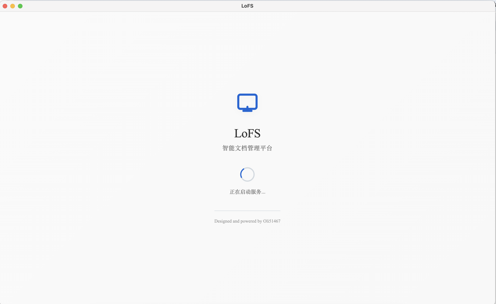

# 🗂️ LoFS · Load once Fast Search

**English** ｜ [中文](README.md)

LoFS (Load once Fast Search) is a desktop-oriented knowledge base manager for local files. Load a folder once and enjoy millisecond semantic and keyword search thereafter.

## ✨ Core Highlights
- 🔍 **Mount once, search fast**: parse Markdown, TXT, Word, PDF (and more), then vectorize both text and images for instant recall.
- 📁 **Modern explorer UX**: context menus for mount/remount/unmount, PDF-specific parsing, and real-time progress indicators.
- 🧠 **Hybrid retrieval engine**: Faiss for semantic vectors, BM25s for keyword recall, plus reranking transformers for precision.
- 🔒 **Local-first**: SQLite + Faiss live entirely on disk; no network connection is required after setup.
- 🛠️ **Ready-to-ship desktop app**: Electron front end + FastAPI backend with multi-platform packaging scripts.

## 🎨 UI Glimpse
| Welcome | PDF Parsing | Search View |
|:--:|:--:|:--:|
|  |  |  |

## 🧭 Project Overview
LoFS blends classic file management with modern semantic retrieval. Key innovations include:
- **Single-pass mounting + persistent embeddings**: eliminates repetitive parsing and re-embedding overhead.
- **Multimodal awareness**: extracts images from Markdown/Word/PDF and vectorizes them via CLIP for text+image search.
- **Transparent workflows**: progress bars and completion notices for mounting, parsing, and remounting keep users informed.

## 🚀 Quick Start
### ✅ Requirements
| Component | Minimum | Recommended |
| --- | --- | --- |
| Python | 3.8 | 3.10+ |
| Node.js | 16 | 18+ |
| npm | 8 | Latest LTS |
| OS | Windows / macOS / Linux | — |

### ⚙️ Installation
```bash
# Clone the repository
git clone <repository-url>
cd LocalFS

# Backend dependencies
python -m venv venv
source venv/bin/activate        # Windows: venv\Scripts\activate
pip install -r server/requirements.txt

# Frontend dependencies
cd electron
npm install
```

### ▶️ Run in Development
```bash
# Terminal 1 — FastAPI backend
python server/main.py

# Terminal 2 — Electron frontend
cd electron
npm run dev
```

### 📦 Package the Desktop App
```bash
python package.py        # all-in-one packaging
./build.sh               # macOS / Linux helper
build.bat                # Windows helper
```

## 🧱 Tech Stack
- **Frontend**: Electron · vanilla HTML/CSS/JavaScript · Axios
- **Backend**: FastAPI · Pydantic · Uvicorn
- **Search**: Faiss · BM25s · FlagEmbedding (BGE family) · CLIP
- **Storage**: SQLite plus the local filesystem

---
LoFS = Local File System + Load once Fast Search — delivering a “load once, search fast” experience for local knowledge bases.
